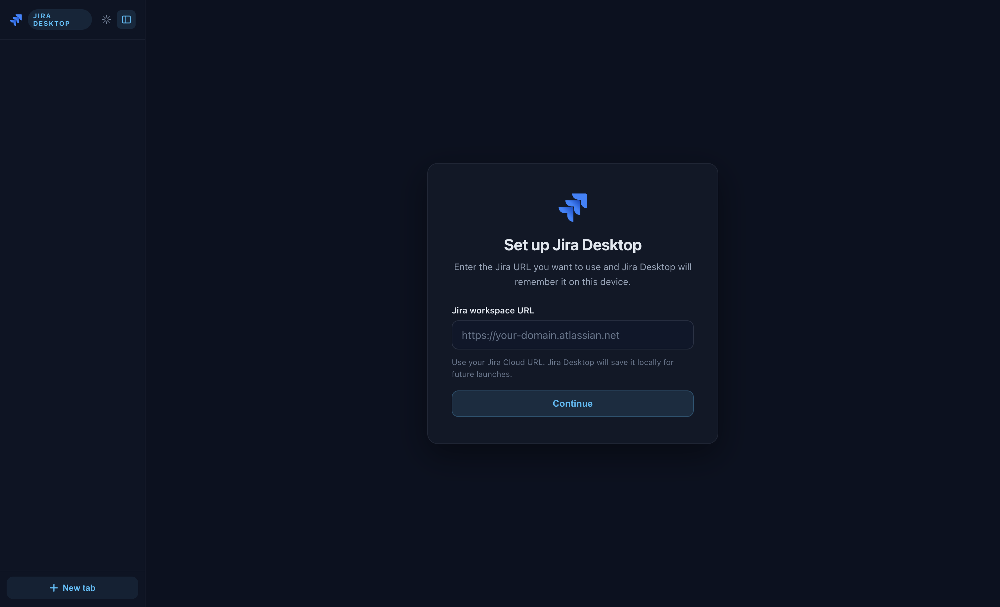
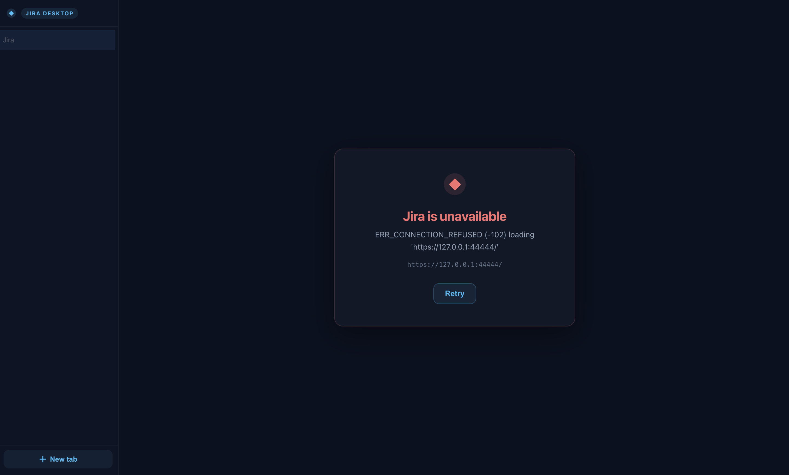

# Jira Desktop

Jira Desktop is a dedicated Jira desktop workspace with fewer browser tabs and safer isolation than a normal browser workflow. It wraps your Jira workspace in a hardened desktop shell, supports multiple tabs, and keeps remote content isolated from the local UI layer.

On first launch, the app asks for your Jira workspace URL and stores it locally so packaged builds work without extra environment setup.

## Features

- Multi-tab Jira browsing inside a single desktop window
- Hardened Electron configuration with `contextIsolation`, `sandbox`, and disabled `nodeIntegration`
- Navigation restricted to Jira and approved Atlassian-adjacent hosts
- Basic loading and error states for failed network loads
- Smoke test coverage for the desktop shell

## Screenshots

### Setup screen



### Network error state



## Requirements

- Node.js 22 or later
- Yarn 1.x
- A Jira Cloud workspace URL such as `https://your-domain.atlassian.net`

## Run locally

```bash
yarn install
yarn start
```

The app will prompt for your Jira URL if one has not been saved yet.

You can also pass the workspace URL on the command line:

```bash
yarn start -- --jira-url=https://your-domain.atlassian.net
```

Or with an environment variable:

```bash
JIRA_URL=https://your-domain.atlassian.net yarn start
```

Both overrides take precedence over the saved local workspace URL.

## First Launch

When no workspace URL is configured, Jira Desktop shows a setup screen and asks for the Jira URL you want to use.

- The entered URL is validated to ensure it is a valid `https://...` Jira URL
- The URL is saved locally on the device for future launches
- You can still override it at runtime with `JIRA_URL` or `--jira-url`

## Configuration

### Saved local workspace URL

For normal packaged-app usage, no environment variables are required. The app stores the selected Jira URL locally after the first successful setup.

### `JIRA_URL`

Optional runtime override. If set, it takes precedence over the saved local workspace URL.

### `JIRA_ALLOWED_HOSTS`

Optional comma-separated list of additional hosts that should be allowed for top-level navigation or notification permission checks. This is useful for SSO providers or Jira-adjacent domains that participate in your login flow.

Example:

```bash
JIRA_URL=https://your-domain.atlassian.net \
JIRA_ALLOWED_HOSTS=auth.example.com,id.atlassian.com \
yarn start
```

## Scripts

```bash
yarn start
yarn test:unit
yarn test:smoke
yarn package:dir
yarn dist
```

## Packaging

Production packaging is handled by `electron-builder`.

```bash
yarn package:dir
yarn dist
```

The macOS build uses a reduced entitlement set intended for a network-only Jira wrapper.

## macOS Download Warning

The published macOS build is currently unsigned and not notarized because this project does not use a paid Apple Developer account.

- macOS may show a warning such as `Apple could not verify "Jira" is free of malware`
- This is expected for the current open-source release process
- The Windows build does not have this Apple-specific limitation

If you still want to open the macOS build:

1. Download and extract the macOS `.zip`
2. Try opening the app once from Finder
3. Open `System Settings > Privacy & Security`
4. Use `Open Anyway` for Jira Desktop, or right-click the app and choose `Open`

If you want a smoother install experience, use the Windows build or build the app locally from source.

## GitHub Releases

The repository includes a GitHub Actions workflow at `.github/workflows/release.yml`.

- Jira Desktop’s release promise is: `A dedicated Jira desktop workspace with fewer browser tabs and safer isolation than a normal browser workflow.`
- Push a tag such as `v1.0.1` to build macOS and Windows artifacts and publish a GitHub Release
- The tag must match the `version` field in `package.json`
- You can also run the workflow manually and optionally provide an existing release tag
- The CI workflow publishes a macOS `.zip` build for reliability on GitHub-hosted macOS runners; local `yarn release-mac` still builds both `.zip` and `.dmg`
- The macOS GitHub Release artifact is unsigned and requires a manual macOS security override to open

## Open Source Notes

- The project is MIT licensed. See `LICENSE`.
- Local build artifacts, logs, and machine-specific files are ignored via `.gitignore`.
- Before publishing your GitHub repository, update `package.json` repository metadata if you want package links to point at the final repo URL.

## Contributing

Contributions are welcome. See `CONTRIBUTING.md` for setup and contribution expectations.
